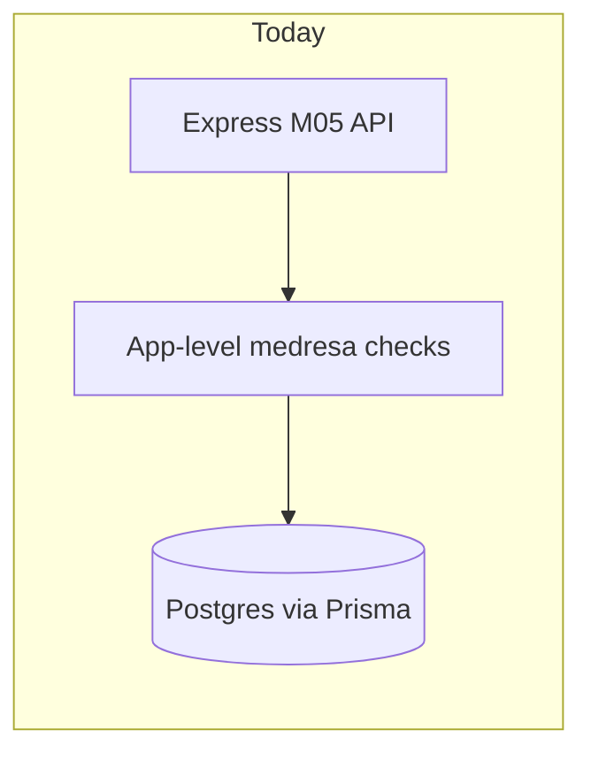
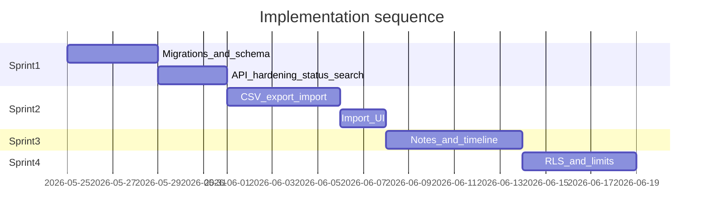

# School Management Improvement Plan (API-first)

## Current state (verified)

Core M05 works: CRUD, course enrollment, transfers, photos, grades/fees integration, and a **Student hub** UI ([`frontend/src/features/students/pages/StudentDetailPage.tsx`](frontend/src/features/students/pages/StudentDetailPage.tsx)). Gaps are concentrated in **data model completeness**, **operational scale** (bulk import/export), **query performance**, **audit/security depth**, and **no Prisma migration history** (deploy uses [`backend/scripts/migrate.sh`](backend/scripts/migrate.sh) → `db push` when `prisma/migrations/` is empty).



Target architecture keeps app-level checks **and** adds DB indexes, richer student lifecycle, bulk ops, and a path to RLS when a restricted DB role is available.

---

## Guiding principles

1. **API before UI** — each slice ships backend + Zod schemas + docs + `make dev-verify-m05` scenarios before UI.
2. **Small migrations** — stop relying on `db push`; every schema change gets a named Prisma migration.
3. **Medresa isolation unchanged** — all new endpoints scoped by `current_medresa_id` / admin role, reusing [`backend/src/lib/student-scope.ts`](backend/src/lib/student-scope.ts).
4. **PaaS-safe first** — Render uses a single superuser URL today ([`render.yaml`](render.yaml)); full RLS is Phase 4 after a restricted `sefinet_app` connection is enforced.
5. **Match existing patterns** — audit via [`backend/src/lib/audit.ts`](backend/src/lib/audit.ts) + `getClientIp`, list pagination like current `listStudentsByMedresa`, response envelope `{ success, data }`.

---

## Phase 1 — Database foundation and M05 API hardening (Sprint 1)

**Goal:** Make student records production-ready for real school operations without changing UX much.

### 1.1 Adopt Prisma migrations

- Baseline migration from current [`backend/prisma/schema.prisma`](backend/prisma/schema.prisma) (`prisma migrate dev --name init`).
- Update [`backend/scripts/migrate.sh`](backend/scripts/migrate.sh) docs in [`docs/05-student.md`](docs/05-student.md) and README so all envs use `migrate deploy`.

### 1.2 Extend `Student` model

| Change | Rationale |
|--------|-----------|
| `enrollment_number String?` + unique per `(current_medresa_id, enrollment_number)` | Schools need readable IDs like `2025/001` |
| `StudentStatus`: add `WITHDRAWN`, `GRADUATED` | Real lifecycle beyond ACTIVE/TRANSFERRED |
| `withdrawn_at`, `graduated_at` optional timestamps | Reporting and timeline |
| `national_id String?`, `blood_group String?`, `allergies String?` | Identity + safety (nullable, optional in API) |
| `secondary_guardian_name`, `secondary_guardian_phone` optional | Second parent support |

Auto-generate `enrollment_number` on create: `{ethiopianYear}/{seq}` per medresa (new helper in `student.service.ts`, sequence via `MAX` + 1 or dedicated counter table if collisions become an issue).

### 1.3 Performance indexes (raw SQL in migration)

```sql
CREATE INDEX idx_student_medresa_status_active
  ON "Student" (current_medresa_id, status)
  WHERE deleted_at IS NULL;

CREATE INDEX idx_student_guardian_phone
  ON "Student" (guardian_phone)
  WHERE deleted_at IS NULL;
```

Keep existing single-column indexes; partial index replaces need for a separate “all rows” composite in most list queries.

### 1.4 Duplicate registration guard

- Application check on create: same `full_name` + `date_of_birth` + `current_medresa_id` where `deleted_at IS NULL` → `409 DUPLICATE_STUDENT`.
- Optional partial unique index (migration) if product accepts strict enforcement:

```sql
CREATE UNIQUE INDEX idx_student_unique_identity
  ON "Student" (current_medresa_id, lower(full_name), date_of_birth)
  WHERE deleted_at IS NULL;
```

### 1.5 Search API expansion

In [`backend/src/modules/m05-student/student.service.ts`](backend/src/modules/m05-student/student.service.ts) `listStudentsByMedresa`, extend `search` OR clause:

- `address` (case-insensitive contains)
run)
- Course name via `student_courses.some.medresa_course.course.name` (localized JSON `en`/`am`/`ar` path — reuse pattern from [`backend/src/lib/localized-string.schema.ts`](backend/src/lib/localized-string.schema.ts))

Existing `medresaCourseId` filter stays.

### 1.6 Audit and security quick wins

- Pass `ip: getClientIp(req)` on **all** `auditLog()` calls in [`student.service.ts`](backend/src/modules/m05-student/student.service.ts) ("/>(pattern from [`fee-payment.service.ts`](backend/src/modules/m08-fees/fee-payment.service.ts)).
- **Photo upload race fix** in `updateStudent`: save new file → update DB → delete old file (delete old only after DB commit succeeds).
- **JWT production**: in [`backend/src/config/env.ts`](backend/src/config/env.ts), require `min(32)` when `NODE_ENV === 'production'` (keep dev at 16).
- **CORS logging**: in [`backend/src/server.ts`](backend/src/server.ts), log a sanitized origin (hostname only or hash) instead of raw attacker URL in `Error` message.

### 1.7 Status transition API

New endpoints (medresa admin only):

- `POST /api/v1/students/:id/withdraw` — body `{ reason?, withdrawnAt? }` → status `WITHDRAWN`, soft-delete active enrollments
- `POST /api/v1/students/:id/graduate` — body `{ graduatedAt? }` → status `GRADUATED`
- `POST /api/v1/students/:id/reactivate` — back to `ACTIVE` (admin only, audited)

Update [`student.schema.ts`](backend/src/modules/m05-student/student.schema.ts), mapper, list filters, and [`docs/05-student.md`](docs/05-student.md).

### 1.8 Permission consolidation (low risk)

- Make `canReadStudentGrades` in [`backend/src/lib/grade-scope.ts`](backend/src/lib/grade-scope.ts) delegate to `loadStudentForAccess` + `canReadStudent` instead of re-querying student — single source of truth.

**Phase 1 exit criteria**

- Migration deploys cleanly on fresh DB and existing dev DB.
- M05 verify script covers withdraw/graduate/reactivate, duplicate rejection, expanded search.
- All student mutations include IP in audit log.

---

## Phase 2 — Bulk import and export (Sprint 2)

**Goal:** Onboarding 50–500 students per medresa without one-by-one modals.

### 2.1 CSV export

`GET /api/v1/medresas/:medresaId/students/export`

- Query params: same filters as list (`search`, `gender`, `status`, `medresaCourseId`)
- Response: `text/csv` stream, columns: enrollment_number, full_name, date_of_birth, gender, address, guardian fields, status, course names (semicolon-separated)
- Access: medresa admin + super admin

Implementation: new `student-export.service.ts`; use streaming (`res.write`) to avoid memory spikes.

### 2.2 CSV import

`POST /api/v1/medresas/:medresaId/students/import`

- `multipart/form-data` field `file` (CSV, max ~5MB, row cap e.g. 500)
- Required columns: `fullName`, `dateOfBirth`, `gender`, `address`, `guardianName`, `guardianPhone`
- Optional: `enrollmentNumber`, `nationalId`, course names for auto-enroll
- **Dry-run mode**: `?dryRun=true` returns `{ valid, errors[], preview[] }` without writes
- **Commit mode**: creates students in a transaction batch; returns `{ created, skipped, errors[] }`
- Row-level validation via Zod; Ethiopian phone schema reused
- Duplicate rows → reported in `errors`, not silent skip (unless `skipDuplicates=true`)

Dependency: add lightweight CSV parser (`csv-parse` — no Excel in v1; XLSX can be Phase 2b if schools require it).

### 2.3 Import audit

- One summary `auditLog` per import batch (`action: INSERT`, `newValues: { rowCount, medresaId, dryRun }`).

### 2.4 Minimal frontend (after API)

- [`MedresaStudentsPage.tsx`](frontend/src/features/students/pages/MedresaStudentsPage.tsx): Import button → upload CSV → show dry-run errors → confirm import; Export button → download CSV.
- i18n keys in `en.json` / `am.json` / `ar.json`.

**Phase 2 exit criteria**

- Import 100-row fixture CSV in dev seed test.
- Export re-import round-trip preserves core fields.
- Verify script extended in [`scripts/verify-m05-student-api.sh`](scripts/verify-m05-student-api.sh).

---

## Phase 3 — Notes, enrollment history, activity timeline (Sprint 3)

**Goal:** Teachers/admins can record context and see a student’s story in one place.

### 3.1 Student notes

New model:

```prisma
model StudentNote {
  id          String   @id @default(uuid())
  student_id  String
  medresa_id  String   // scope notes to medresa
  author_id   String   // User id
  body        String
  is_private  Boolean  @default(true)  // teacher/admin only
  deleted_at  DateTime?
  created_at  DateTime @default(now())
  updated_at  DateTime @updatedAt
}
```

API:

- `GET /api/v1/students/:id/notes`
- `POST /api/v1/students/:id/notes`
- `PATCH /api/v1/students/:id/notes/:noteId` (author or admin)
- Soft-delete note

Teachers: can read/write notes for students in their courses; admins: all notes in medresa.

### 3.2 Enrollment year tracking

New model `StudentEnrollmentPeriod`:

- `student_id`, `medresa_id`, `started_at`, `ended_at?`, `end.z.enum(['ENROLLED','TRANSFERRED','WITHDRAWN','GRADUATED'])`
- Hooks: create period on student create; close period + open new on transfer; close on withdraw/graduate

This replaces the vague “year-to-year” gap without overloading `Student.enrolled_at`.

### 3.3 Activity timeline API

`GET /api/v1/students/:id/timeline?limit=50&cursor=`

Server-side merge (sorted by `occurredAt` desc):

| Source | Event types |
|--------|-------------|
| `StudentEnrollmentPeriod` | enrolled, withdrawn, graduated, reactivated |
| `StudentTransfer` | transferred |
| `StudentCourse` | course_enrolled, course_removed |
| `Grade` | grade_recorded |
| `FeePayment` | fee_paid |
| `AttendanceRecord` | attendance_marked (optional — can be noisy; default off via `?include=attendance`) |
| `StudentNote` | note_added |

Returns unified `{ items: [{ type, occurredAt, summary, metadata }] }`.

### 3.4 Frontend

- New hub tab `timeline` in [`StudentHubTabs.tsx`](frontend/src/features/students/components/hub/StudentHubTabs.tsx) + notes panel on profile or separate tab.

---

## Phase 4 — Security, performance, and structural debt (Sprint 4)

### 4.1 RLS (when DB role allows)

Prerequisite: production `DATABASE_URL` uses `sefinet_app` (not admin superuser) — documented in [`sql/init.sql`](sql/init.sql) / Docker setup; PaaS needs a second restricted user or accept app-only isolation until then.

Steps:

1. Middleware sets Postgres session vars per request after JWT verify: `SET app.user_id`, `SET app.is_super_admin`, `SET app.medresa_ids` (JSON array)
2. Implement policies in [`sql/rls-policies.sql`](sql/rls-policies.sql) for tenant tables (`Student`, `StudentCourse`, `FeePayment`, etc.)
3. Prisma `$executeRaw` at start of request transaction (or connection hook via adapter)
4. Integration test: teacher JWT cannot read other medresa’s student even with raw ID guess

**Do not block Phases 1–3 on RLS** — app checks are the primary guard today; RLS is defense-in-depth.

### 4.2 Rate limiting refinements

- Dedicated upload limiter on `POST .../photo` and `POST .../import` (e.g. 20/hour per IP)
- Optional higher read limiter for list endpoints (currently global 100/min in [`server.ts`](backend/src/server.ts) is tight for dashboards)

### 4.3 Batch enrichment (optional)

If list/detail at scale becomes slow:

- Add `GET /api/v1/medresas/:medresaId/students?include=gradesSummary,feeStatus` with batched queries in one service method (avoid N+1 from [`enrichStudentDetail`](backend/src/modules/m05-student/student.service.ts)).

### 4.4 Route consolidation (tech debt)

Merge [`student.routes.ts`](backend/src/modules/m05-student/student.routes.ts), [`medresa-student.routes.ts`](backend/src/modules/m05-student/medresa-student.routes.ts), [`teacher-student.routes.ts`](backend/src/modules/m05-student/teacher-student.routes.ts) into one `student.router.ts` with sub-routers — no URL changes, easier maintenance.

### 4.5 CSRF (defer unless required)

Refresh token is httpOnly cookie ([`auth-cookies.ts`](backend/src/lib/auth-cookies.ts)); access token is Bearer. SameSite cookies + CORS origin allowlist may suffice short-term. Add CSRF double-submit token only if cookie-based mutations expand beyond refresh.

---

## Phase 5 — Cross-module polish (ongoing)

| Item | Module | Notes |
|------|--------|-------|
| FeeBalance DB trigger | M08 | Optional; app `recomputeFeeBalance` works today |
| `StudentTransfer.deleted_at` | M05 | Soft-delete transfers for admin correction |
| Teacher bulk roster export | M05 | Reuse CSV infra |
| Medresa Admin UX backlog | E11 | Import/export buttons align with [`docs/ux-backlog/Medresa-Admin-UX.md`](docs/ux-backlog/Medresa-Admin-UX.md) |

---

## Recommended execution order



**Start here:** Phase 1 entirely — highest leverage, lowest UX risk, unblocks everything else.

---

## Files touched (by phase)

| Phase | Primary files |
|-------|----------------|
| 1 | [`backend/prisma/schema.prisma`](backend/prisma/schema.prisma), new migration, [`student.service.ts`](backend/src/modules/m05-student/student.service.ts), [`student.schema.ts`](backend/src/modules/m05-student/student.schema.ts), [`student.mapper.ts`](backend/src/modules/m05-student/student.mapper.ts), [`student.controller.ts`](backend/src/modules/m05-student/student.controller.ts), [`env.ts`](backend/src/config/env.ts), [`server.ts`](backend/src/server.ts), [`docs/05-student.md`](docs/05-student.md) |
| 2 | New `student-import.service.ts`, `student-export.service.ts`, routes in medresa router, frontend students feature |
| 3 | New models + `student-timeline.service.ts`, hub components |
| 4 | [`sql/rls-policies.sql`](sql/rls-policies.sql), auth middleware, route merge |

---

## Out of scope (for now)

- Excel (`.xlsx`) import — add after CSV proven
- Full CSRF framework
- Nginx config in repo (document in deploy guide only)
- Replacing app-level auth with RLS-only security
